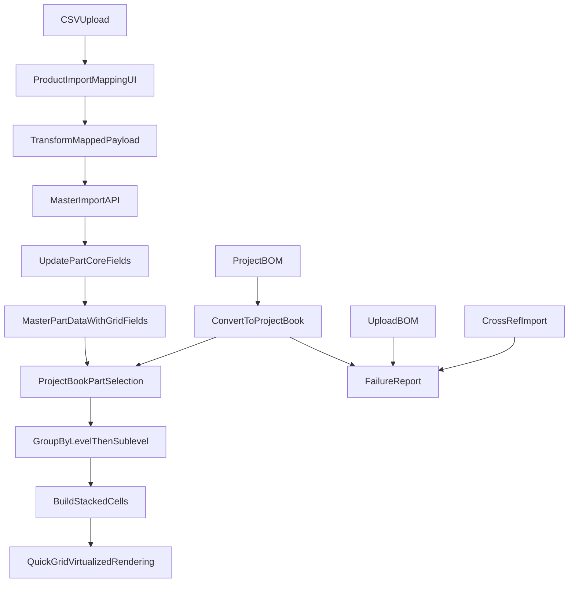

# Product Grid + MASTER Core Data Plan

## Open Questions (Resolve Before Execution)

These items contain contradictions or gaps that must be decided before the relevant phase begins.

> **[OPEN QUESTION — OQ-1] Missing level/sublevel behavior: exclude vs. Unassigned bucket**
>
> Three sections in the original plan said contradictory things:
> - "Confirmed Direction" said missing level/sublevel → `Unassigned` bucket.
> - "Clarifications" said parts missing level/sublevel are *excluded* from Project Book and logged to Failure Report.
> - "Launch Behavior Lock" said `Unassigned` bucket (not hidden).
>
> **Recommended answer:** These are two separate concerns that should be split by context:
> - **During BOM → Project Book conversion:** parts without both `gridLevelNumber` AND `gridSublevelNumber` are **excluded** from the created Project Book and logged to FailureReport (`MISSING_LEVEL_SUBLEVEL`). This is the strict conversion gate.
> - **During grid display:** any part that has null grid values (e.g., from a later MASTER re-import that cleared the field) is shown in an **Unassigned** row/column bucket — it is never silently hidden.
>
> Confirm or override before Phase 2 begins. All sections below have been updated to reflect this split.

---

> **[OPEN QUESTION — OQ-2] Phase 3 builds grid UI before Phase 4 renames the DB — guaranteed rework**
>
> Phase 3 implements the grid UI referencing `catalogId` internally. Phase 4 then renames `catalogId` → `projectBookId` everywhere. This means Phase 3 code will need partial refactoring in Phase 4.
>
> **Recommended answer:** Use Prisma `@@map` / `@map` aliases in Phase 1 so the codebase uses `ProjectBook` / `projectBookId` naming immediately while the database columns remain `catalogs` / `catalog_id` temporarily. Phase 4 then becomes a low-risk DB-only cleanup with no Prisma/codebase changes required. Example:
> ```prisma
> model ProjectBook {
>   id              String  @id @default(uuid())
>   sourceCatalogId String? @map("source_catalog_id")
>   @@map("catalogs")
> }
> ```
> Confirm or override before Phase 1 begins.

---

> **[OPEN QUESTION — OQ-3] Migration script is incomplete — steps 4 and 5 were placeholders**
>
> The original script ended with `-- 4. Recreate foreign keys` and `-- 5. Rename catalog_assignments, catalog_items if desired` as comments only. Running this against production would leave FKs missing.
>
> **Recommended answer:** The Migration Script section below now contains the full completed script. Review and confirm it is complete for your actual schema before Phase 4 begins. Also confirm the pre-migration backup step and post-migration integrity verification queries are in the deploy runbook.

---

> **[OPEN QUESTION — OQ-4] NonWagoProduct table — confirm it exists before implementing the BOM upload check**
>
> The BOM upload failure plan says to check `NonWagoProduct` before logging `NO_MATCH`. However, the current `uploadBOM` controller does not reference a `NonWagoProduct` model, and no such model was found in the schema exploration.
>
> **Recommended answer:** Confirm the `NonWagoProduct` Prisma model name and the field used to match an uploaded part number before implementing `bom-upload-failures`. If the model does not exist yet, this failure type must be simplified to `NO_WAGO_MATCH` (part number not in `Part` table) until that model is available.

---

> **[OPEN QUESTION — OQ-5] Who can perform BOM → Project Book conversion?**
>
> No role or permission was specified in the original plan.
>
> **Recommended answer:** Restrict to ADMIN and RSM roles in v1, matching the pattern used for BOM upload and product import. Add a role guard to the conversion endpoint before Phase 3 begins. Confirm or override.

---

## Confirmed Direction (Locked)

- `level/sublevel` values should be stored in MASTER product core data (part-level), not project-item overrides for v1.
- Uploads must support mapping/importing these fields directly from CSV.
- Add `PriceDate` as a mappable data point.
- PriceDate behavior:
  - If mapped and valid -> update value.
  - If mapped but row value blank/invalid -> leave existing value unchanged.
- Grid ordering intent: simple products first; users scroll downward to more complex groups.
- Missing level/sublevel behavior is split by context (see OQ-1 for resolution):
  - **Conversion gate:** parts without both grid fields are excluded and logged to FailureReport.
  - **Grid display:** parts with null grid fields (for any reason) fall into the `Unassigned` row/column bucket — never silently hidden.
- `priceDate` storage type is locked to date-only (no time component).
- `gridLevelNumber` and `gridSublevelNumber` minimum valid value is **1** (not 0). Zero is not a valid level; use `null` for "not set."
- Terminology and menu locks for this release:
  - Main menu `Catalog` is renamed to `Quick Grid`.
  - Main menu `My Catalogs` is renamed to `My Project Books`.
  - Main menu `Projects` remains unchanged.
  - Rollout style is immediate replacement (no temporary dual labels).
- Functional relationship lock:
  - A `Project` (its BOM) can be converted into a `Project Book`.
  - Project Book is the grouping/container used for the new grid menu experience.
- URL routes (`/catalogs`, `/catalog-list`, etc.) are **not** renamed in this release. Route rename is deferred to a future release.

## Clarifications (Locked)

| Topic | Decision |
|-------|----------|
| **Non-WAGO parts** | Stored in Non-WAGO Database (ADMIN → Reference Data). Do **not** port into Project Books. Remain in Projects only. |
| **Test data** | Existing non-MASTER catalogs, quotes, customer list are test data; can be ignored or wiped for migration. |
| **Project Book conversion** | Only WAGO parts with both `gridLevelNumber` AND `gridSublevelNumber` (>= 1) are added. Parts missing either field are excluded and logged to Failure Report. Parts that later lose grid metadata (via MASTER re-import) are shown in Unassigned bucket during grid display — not hidden. |
| **PriceDate format** | Support `M/D/YYYY` (e.g. `9/1/2025`), `MM/DD/YYYY`, `YYYY-MM-DD` in CSV import. |
| **Conversion permission** | ADMIN and RSM only (see OQ-5). |
| **Project Book mutability** | After conversion, a Project Book is editable (parts can be added/removed). It is not a read-only snapshot. |

## Current System Context

- Product import pipeline (MASTER-only) lives in [backend/src/controllers/productImport.controller.ts](backend/src/controllers/productImport.controller.ts) and [frontend/src/pages/admin/ProductImport.tsx](frontend/src/pages/admin/ProductImport.tsx).
- Product data model currently lives in [backend/prisma/schema.prisma](backend/prisma/schema.prisma) under `Part`.
- **Note:** The `Part` model already has an existing field named `level`. Before adding `gridLevelNumber`, confirm whether this field represents the same concept (in which case rename it rather than duplicate) or a different concept (in which case document the distinction clearly).
- Project book item browsing is currently a flat list/table in [frontend/src/pages/projects/ProjectDetail.tsx](frontend/src/pages/projects/ProjectDetail.tsx).
- Catalog navigation is category-scroll oriented in [frontend/src/pages/catalog/Catalog.tsx](frontend/src/pages/catalog/Catalog.tsx).
- Main navigation labels (`Catalog`, `My Catalogs`, etc.) are defined in [frontend/src/components/layout/Sidebar.tsx](frontend/src/components/layout/Sidebar.tsx).
- Cross-reference import has two implementations in [backend/src/controllers/admin.controller.ts](backend/src/controllers/admin.controller.ts): `importCrossReferences` (simple CSV) and `importCrossReferencesMaster` (column-mapping wizard).
- BOM upload is `uploadBOM` in [backend/src/controllers/project.controller.ts](backend/src/controllers/project.controller.ts).

## Terminology Migration Track (Full Scope)

This release includes wholesale terminology migration from Catalog language to Project Book language, including database naming.

### Target language

- `Catalog` -> `ProjectBook` where the concept is user-facing book/grouping.
- `My Catalogs` -> `My Project Books`.
- `Catalog` main nav item -> `Quick Grid`.
- Preserve `Projects` menu item and project lifecycle wording.

### Scope layers

- UI text and navigation labels.
- Frontend route labels, breadcrumbs, and page headings.
- API contracts (endpoint names, request/response keys where practical).
- TypeScript types and store naming.
- Prisma/database model and field renames where approved.
- Docs, onboarding copy, and admin terminology.

### Migration safety strategy

- **Preferred approach (see OQ-2):** Use Prisma `@@map` / `@map` aliases from Phase 1 so the codebase uses `ProjectBook` naming immediately while the database columns stay as-is. Phase 4 then becomes a DB-only rename with minimal code changes.
- Use staged DB migrations with compatibility windows where needed.
- Add temporary API aliases/translation where contract breaks are likely.
- Run data migration scripts for renamed tables/columns.
- Validate reports, filters, and permissions after renaming.
- **Auth/JWT:** When `User.catalogId` → `projectBookId` is renamed in the auth payload, existing sessions will fail payload reads. Plan for a coordinated deploy with session invalidation, or add a JWT payload version field to handle both names during a migration window.

---

## Full DB Migration: Catalog → ProjectBook — Roadblocks & Mitigation

### Scope of Rename

| Current | Target |
|---------|--------|
| Model `Catalog` | `ProjectBook` |
| Table `catalogs` | `project_books` |
| `catalogId` / `catalog_id` | `projectBookId` / `project_book_id` |
| `CatalogItem` | `ProjectBookItem` (full rename — not optional) |
| `CatalogAssignment` | `ProjectBookAssignment` |
| `sourceCatalogId` | `sourceProjectBookId` |

### Tables & Columns Affected

| Table | Column(s) | FK Target |
|-------|-----------|-----------|
| `users` | `catalog_id` | catalogs |
| `catalog_assignments` | `catalog_id` | catalogs |
| `catalogs` | `id`, `source_catalog_id` | self |
| `catalog_items` | `catalog_id` | catalogs |
| `categories` | `catalog_id` | catalogs |
| `parts` | `catalog_id` | catalogs |
| `quotes` | `catalog_id` | catalogs |
| `projects` | `catalog_id` | catalogs |

### Roadblocks

| Roadblock | Mitigation |
|-----------|------------|
| **PostgreSQL migration** | Single migration script: drop FKs → rename table/columns → recreate FKs. Run in transaction. See completed script below. |
| **Prisma + codebase** | If OQ-2 approach is used, codebase already uses ProjectBook naming via aliases. Phase 4 removes aliases; no logic changes needed. Otherwise update schema, run `prisma generate`, then update all `catalog` → `projectBook` references. |
| **API contract** | Breaking change in responses; update all consumers or add temporary aliases. |
| **Routes** | Keep `/catalogs`, `/catalog-creator`, `/catalog-list` for URLs; only change labels. Route rename deferred to future release. |
| **Seed data** | Update seed to create "Master Project Book" instead of "Master Catalog". |
| **Auth/JWT** | Update `User.catalogId` → `projectBookId` in auth payload. Coordinate with session invalidation or JWT versioning. |
| **Third-party integrations** | Document breaking change; coordinate with integrators. |
| **Composite index** | The index `(catalogId, gridLevelNumber, gridSublevelNumber, partNumber)` added in Phase 1 references `catalog_id`. After Phase 4, Prisma regenerates it under `project_book_id`. If aliases are used from Phase 1, no performance regression window — the column name change is atomic with the DB migration. |

### Recommended Migration Order

1. Add new Part fields + import pipeline. Apply Prisma `@@map` aliases (OQ-2 approach) so codebase uses ProjectBook naming from day 1.
2. Create migration for Catalog → ProjectBook (rename table, columns, FKs) — DB-only if aliases were used.
3. Codebase update (backend, frontend, seed) in single coordinated release — minimal if aliases used.
4. Smoke test with pre/post row count and FK integrity checks; deploy.

### Migration Script (PostgreSQL — Complete)

**Pre-migration step:** Take a full database backup before running. Add this to the deploy runbook.

```sql
BEGIN;

  -- 1. Drop foreign keys referencing catalogs
  ALTER TABLE users DROP CONSTRAINT IF EXISTS users_catalog_id_fkey;
  ALTER TABLE catalog_assignments DROP CONSTRAINT IF EXISTS catalog_assignments_catalog_id_fkey;
  ALTER TABLE catalog_items DROP CONSTRAINT IF EXISTS catalog_items_catalog_id_fkey;
  ALTER TABLE categories DROP CONSTRAINT IF EXISTS categories_catalog_id_fkey;
  ALTER TABLE parts DROP CONSTRAINT IF EXISTS parts_catalog_id_fkey;
  ALTER TABLE quotes DROP CONSTRAINT IF EXISTS quotes_catalog_id_fkey;
  ALTER TABLE projects DROP CONSTRAINT IF EXISTS projects_catalog_id_fkey;
  ALTER TABLE catalogs DROP CONSTRAINT IF EXISTS catalogs_source_catalog_id_fkey;

  -- 2. Rename main table
  ALTER TABLE catalogs RENAME TO project_books;

  -- 3. Rename self-referencing column in project_books
  ALTER TABLE project_books RENAME COLUMN source_catalog_id TO source_project_book_id;

  -- 4. Rename columns in dependent tables
  ALTER TABLE users RENAME COLUMN catalog_id TO project_book_id;
  ALTER TABLE catalog_assignments RENAME COLUMN catalog_id TO project_book_id;
  ALTER TABLE catalog_items RENAME COLUMN catalog_id TO project_book_id;
  ALTER TABLE categories RENAME COLUMN catalog_id TO project_book_id;
  ALTER TABLE parts RENAME COLUMN catalog_id TO project_book_id;
  ALTER TABLE quotes RENAME COLUMN catalog_id TO project_book_id;
  ALTER TABLE projects RENAME COLUMN catalog_id TO project_book_id;

  -- 5. Rename junction tables
  ALTER TABLE catalog_assignments RENAME TO project_book_assignments;
  ALTER TABLE catalog_items RENAME TO project_book_items;

  -- 6. Recreate foreign keys
  ALTER TABLE users ADD CONSTRAINT users_project_book_id_fkey
    FOREIGN KEY (project_book_id) REFERENCES project_books(id);
  ALTER TABLE project_book_assignments ADD CONSTRAINT project_book_assignments_project_book_id_fkey
    FOREIGN KEY (project_book_id) REFERENCES project_books(id);
  ALTER TABLE project_book_items ADD CONSTRAINT project_book_items_project_book_id_fkey
    FOREIGN KEY (project_book_id) REFERENCES project_books(id);
  ALTER TABLE categories ADD CONSTRAINT categories_project_book_id_fkey
    FOREIGN KEY (project_book_id) REFERENCES project_books(id);
  ALTER TABLE parts ADD CONSTRAINT parts_project_book_id_fkey
    FOREIGN KEY (project_book_id) REFERENCES project_books(id);
  ALTER TABLE quotes ADD CONSTRAINT quotes_project_book_id_fkey
    FOREIGN KEY (project_book_id) REFERENCES project_books(id);
  ALTER TABLE projects ADD CONSTRAINT projects_project_book_id_fkey
    FOREIGN KEY (project_book_id) REFERENCES project_books(id);
  ALTER TABLE project_books ADD CONSTRAINT project_books_source_project_book_id_fkey
    FOREIGN KEY (source_project_book_id) REFERENCES project_books(id);

COMMIT;
```

**Post-migration verification (run immediately after COMMIT):**
```sql
-- Confirm row counts match pre-migration snapshot
SELECT COUNT(*) FROM project_books;
SELECT COUNT(*) FROM project_book_items;
SELECT COUNT(*) FROM project_book_assignments;

-- Confirm FK integrity (each should return 0)
SELECT COUNT(*) FROM parts WHERE project_book_id NOT IN (SELECT id FROM project_books);
SELECT COUNT(*) FROM projects WHERE project_book_id NOT IN (SELECT id FROM project_books);
SELECT COUNT(*) FROM quotes WHERE project_book_id NOT IN (SELECT id FROM project_books);
SELECT COUNT(*) FROM categories WHERE project_book_id NOT IN (SELECT id FROM project_books);
```

---

## V1 Data Model Changes

### Part model — new fields

Add fields to `Part` (MASTER core data):

- `gridLevelNumber` (integer >= 1, nullable — `null` means "not set"; 0 is invalid and rejected at import)
- `gridLevelName` (string, nullable)
- `gridSublevelNumber` (integer >= 1, nullable — `null` means "not set")
- `gridSublevelName` (string, nullable)
- `priceDate` (date-only, nullable)

**Important — existing `level` field:** The `Part` model already has a field named `level`. Before adding `gridLevelNumber`, confirm whether it is the same concept (rename it rather than add a duplicate) or a different concept (document the distinction). Do not proceed with Phase 1 until this is resolved.

Notes:

- Keep nullable in phase 1 so existing parts remain valid without backfill.
- Add composite index optimized for browsing/sort:
  - `(catalogId, gridLevelNumber, gridSublevelNumber, partNumber)`
  - After Phase 4, this is automatically regenerated under `(projectBookId, ...)` — no manual action if aliases are used from Phase 1.
- Keep existing fields untouched to reduce migration risk.

### Catalog (ProjectBook) model — new fields for conversion traceability

Add to `Catalog` / `ProjectBook`:

- `sourceType` (enum: `MANUAL` | `CONVERTED_FROM_BOM`, default `MANUAL`) — records how the Project Book was created.
- `sourceProjectId` (uuid, nullable FK to `projects.id`) — populated when converted from a BOM.
- `sourceRevision` (string, nullable) — the BOM revision identifier used at conversion time.

### FailureReport model — new table

New table: `FailureReport`

| Column | Type | Description |
|--------|------|-------------|
| `id` | uuid | PK |
| `source` | enum | `BOM_UPLOAD`, `PROJECT_BOOK_CONVERSION`, `CROSS_REF_IMPORT` |
| `failureType` | string | Specific failure code |
| `importBatchId` | string? | Links to the originating import batch — enables grouping all failures from one operation |
| `context` | jsonb | Flexible: projectId, partNumber, manufacturer, rowIndex, etc. |
| `message` | text | Human-readable summary |
| `createdAt` | timestamp | When recorded |
| `userId` | uuid? | User who triggered (if applicable) |
| `resolvedAt` | timestamp? | When marked resolved |
| `resolvedById` | uuid? | ADMIN user who marked resolved |
| `resolutionNote` | text? | Reason or action taken at resolution |

**Retention policy:** Resolved records are auto-archived (soft-deleted or moved to archive table) after 90 days. Unresolved records are flagged for review after 365 days. Implement as a scheduled cleanup job delivered in Phase 2.

## Import Enhancements (MASTER Upload)

### Frontend mapping updates

Update mapping options in [frontend/src/pages/admin/ProductImport.tsx](frontend/src/pages/admin/ProductImport.tsx):

- Add selectable target fields:
  - `Grid Level Number`
  - `Grid Level Name`
  - `Grid Sublevel Number`
  - `Grid Sublevel Name`
  - `Price Date`
- Preserve existing update-only behavior:
  - only `Part Number` required in update-only mode
  - these fields optional and update only when mapped/present

### Backend import processing updates

Update row processing in [backend/src/controllers/productImport.controller.ts](backend/src/controllers/productImport.controller.ts):

- If mapped value exists:
  - parse and store level/sublevel numbers and names
  - parse/store `priceDate`
- If `PriceDate` mapped but value blank/invalid:
  - do not overwrite existing `priceDate`
  - do not fail row
- Keep not-found behavior in update-only mode unchanged.

### Validation and parsing rules

- `gridLevelNumber` and `gridSublevelNumber`: integer >= 1 (values <= 0 are invalid; treat as not-set, do not overwrite existing value)
- names: trim whitespace, allow null
- `priceDate`: accept CSV date formats including `M/D/YYYY` (e.g. `9/1/2025`), `MM/DD/YYYY`, `YYYY-MM-DD`; normalize to canonical date-only storage
- invalid numeric/date values:
  - do not crash import batch
  - collect row-level warnings/errors as appropriate

---

## Failure Report (ADMIN)

### Purpose

Central ADMIN report capturing all operational failures across BOM upload, Project Book conversion, and Cross-Reference import.

### Failure Types to Capture

| Source | Failure Type | When |
|--------|--------------|------|
| **BOM Upload** | `NO_MATCH` | Part number has no WAGO Part AND no Non-WAGO Product (confirm model per OQ-4) |
| **Project Book Conversion** | `MISSING_LEVEL_SUBLEVEL` | WAGO part has no `gridLevelNumber` or `gridSublevelNumber` |
| **Cross-Ref Import (simple)** | `WAGO_PART_NOT_FOUND` | `wagoPartNumber` not in Part table |
| **Cross-Ref Import (MASTER)** | `NO_WAGO_CROSS` | Both `wagoCrossA` and `wagoCrossB` blank |
| **Cross-Ref Import (MASTER)** | `WAGO_PART_NOT_FOUND` | WAGO part from `wagoCrossA`/`wagoCrossB` not in Part |

### Implementation Notes

- **BOM Upload**: Extend `uploadBOM` to check `NonWagoProduct` (confirm model name per OQ-4); if no Part and no NonWagoProduct, insert `FailureReport` row with `importBatchId` from the upload session. Add a project-level upload concurrency guard (e.g., `uploadLock` boolean or optimistic revision locking) before implementing this to prevent two simultaneous replace-mode uploads from interleaving destructively.
- **Project Book Conversion**: For each ProjectItem with `partId`, check Part for `gridLevelNumber` and `gridSublevelNumber`. If either is null, skip adding to Project Book and insert `FailureReport` with `importBatchId` from the conversion session.
- **Cross-Ref Import**: Both `importCrossReferences` and `importCrossReferencesMaster` persist failures to `FailureReport` (in addition to returning them in response). Pass `importBatchId` from the existing `importBatchId`/`importBatch` return values.

### Resolution Workflow

- ADMIN users can mark individual failures as resolved via the Failure Report UI.
- Resolution requires entering a `resolutionNote` (free text) explaining the action taken.
- `resolvedAt` and `resolvedById` are set on save.
- Resolved failures remain visible in the UI for 90 days (hidden by default; accessible via "Show resolved" toggle), then auto-archived per the retention policy.

### UI Placement

- New ADMIN page `/admin/failure-report` with filters: source, date range, resolved status.
- Add "Failure Report" to Admin sidebar (under Data Management or equivalent).
- Default view: unresolved failures, most recent first.
- Include a "Show resolved" toggle to surface resolved records within the 90-day window.

---

## Product Grid View (Project Book)

### Grouping and ordering contract

- Row grouping key: `gridLevelNumber` (ascending)
- Column grouping key: `gridSublevelNumber` (ascending)
- Cell grouping: all parts sharing same `(level, sublevel)`
- Tie-breaker within stacked cell: `partNumber` ascending (default)

### Display rules

- Show row label: `levelNumber + levelName`
- Show column label: `sublevelNumber + sublevelName`
- If name missing, show number-only fallback.
- Duplicate sublevel in same row renders one cell with stack count.
- Parts missing one or both numeric values are placed in `Unassigned` row and/or `Unassigned` column — displayed at the end of the grid, not the beginning.

### Stack behavior

- Cell shows primary icon + count badge for `N > 1`.
- Scroll wheel / up-down control cycles parts in stack.
- Click opens full detail list for that cell.

### Grid UI states (all required)

- **Loading:** skeleton grid (row/column placeholders) while data fetches.
- **Error:** error banner with a retry action if the fetch fails.
- **Empty:** "No parts in this Project Book yet" message with appropriate CTA.
- **Unassigned bucket populated:** visually distinct row/column rendered at the end of the grid for parts missing grid metadata.
- **Unassigned bucket empty:** omit the Unassigned row/column from the render entirely when no parts are missing metadata.

### Data fetch strategy (v1)

- Fetch all parts for the Project Book in a single API call on mount.
- Precompute the grouped matrix client-side once per dataset change.
- This is acceptable for v1 at up to 1,000 parts. Document 5,000+ as the threshold to revisit server-side pagination or streaming.

### Performance envelope

- Target data size: 50–1,000 parts per project book.
- Use virtualization/windowing for rows/columns to avoid large DOM renders.
- Lazy-load thumbnail/icon assets.
- Precompute grouped matrix once per dataset change.

## Project BOM -> Project Book Conversion

### Conversion intent

- Allow users to take a Project BOM and create a Project Book container from it.
- Converted Project Book becomes available in `My Project Books` and browsable via `Quick Grid`.
- **Role restriction:** ADMIN and RSM only (see OQ-5).

### Conversion rules (v1)

- Source: selected project + selected BOM revision (or current active revision).
- Copy part references and key display metadata needed for grid browsing.
- Preserve traceability by storing `sourceProjectId`, `sourceRevision`, and `sourceType: CONVERTED_FROM_BOM` on the created Project Book.
- Avoid destructive behavior: conversion creates new Project Book records and does not alter the original project BOM.
- Non-WAGO items stay in Projects; only WAGO parts with both `gridLevelNumber` AND `gridSublevelNumber` (>= 1) are added to Project Book. Parts missing either field are excluded and logged to Failure Report.

### Post-conversion behavior

- New Project Book is immediately visible in user assignments/lists.
- Grid uses MASTER level/sublevel metadata for placement.
- Items missing grid metadata (e.g., due to later MASTER re-imports) follow the fallback strategy: displayed in the Unassigned bucket during grid display.

---

## Rollout Phases

### Phase 1: Schema + menu labels

- **Entry gate:** OQ-1 and OQ-2 confirmed.
- Confirm existing `Part.level` field semantics before adding new grid fields.
- Add Part fields (`gridLevelNumber`, `gridLevelName`, `gridSublevelNumber`, `gridSublevelName`, `priceDate`) + Prisma migration.
- Add `sourceType`, `sourceProjectId`, `sourceRevision` to Catalog/ProjectBook model.
- Apply Prisma `@@map`/`@map` aliases if adopting OQ-2 approach (recommended).
- Implement nav/text replacement: `Catalog` → `Quick Grid`, `My Catalogs` → `My Project Books` in [frontend/src/components/layout/Sidebar.tsx](frontend/src/components/layout/Sidebar.tsx).
- Ensure part read endpoints include new fields.

### Phase 2: Import pipeline + Failure Report

- **Entry gate:** OQ-4 confirmed.
- Extend frontend mapper and backend import logic for grid fields and priceDate.
- Add FailureReport table and persistence (including `importBatchId`, `resolvedById`, `resolutionNote`, retention cleanup job).
- Add concurrency guard to BOM upload before implementing failure logging.
- BOM upload: NonWagoProduct check (confirm model per OQ-4) + FailureReport for no-match.
- Cross-ref import: persist failures to FailureReport with `importBatchId`.
- Create [docs/product-import-guide.md](docs/product-import-guide.md) — **note:** this file does not yet exist and must be created as part of this phase.

### Phase 3: BOM conversion + grid UI v1

- **Entry gate:** OQ-5 confirmed.
- Implement BOM to Project Book conversion workflow (ADMIN/RSM only); log missing level/sublevel to FailureReport.
- Persist `sourceProjectId`, `sourceRevision`, `sourceType: CONVERTED_FROM_BOM` on conversion output.
- Implement grouped matrix + stack interaction including all grid UI states (loading, error, empty, Unassigned bucket variants).
- Add Failure Report ADMIN UI with resolution workflow.
- Add level/sublevel labels and fallback states.

### Phase 4: Full DB migration (Catalog → ProjectBook)

- Run pre-migration database backup.
- Execute the completed migration script above.
- If OQ-2 aliases were used: remove `@@map`/`@map` directives in Prisma schema to match new DB column names; run `prisma generate`.
- Update seed script.
- Post-migration: run row count and FK integrity verification queries (see above).
- Coordinate deploy with session invalidation or JWT version bump if `User.catalogId` is in the auth payload.

### Phase 5: Validation + release readiness

- Run test datasets (50 / 300 / 1,000 parts).
- Verify import edge cases, terminology coverage, BOM conversion, Failure Report.
- Validate scroll performance and cell interaction behavior.
- Confirm all grid UI states render correctly (loading, error, empty, Unassigned bucket populated vs. empty).

## Functional Test Checklist

- MASTER update-only import with only `Part Number + Grid Level/Sublevel` succeeds.
- MASTER update-only import with only `Part Number + PriceDate` succeeds.
- Parts missing from MASTER appear under not-found without failing entire import.
- `gridLevelNumber` = 0 is rejected as invalid during import; existing value is not overwritten.
- Main menu labels display as `Quick Grid`, `My Project Books`, and `Projects`.
- Project BOM can be converted to Project Book by ADMIN/RSM; appears in My Project Books.
- Non-ADMIN/RSM users cannot access the conversion workflow.
- Parts without level/sublevel are excluded from conversion and appear in Failure Report.
- BOM upload rows with no WAGO or Non-WAGO match appear in Failure Report.
- Cross-ref import failures (no WAGO cross, WAGO part not found) appear in Failure Report.
- Failure Report: ADMIN can mark a record resolved with a note; record shows `resolvedAt` and `resolvedById`.
- Resolved failures are hidden by default; visible via "Show resolved" toggle.
- Grid rows appear in ascending level order.
- Grid columns appear in ascending sublevel order.
- Duplicate sublevel items collapse into a single stacked cell.
- Missing level/sublevel values are routed to `Unassigned` row/column and remain visible (not hidden).
- Unassigned row/column is omitted entirely when no parts are missing metadata.
- `priceDate` persists and round-trips as date-only value.
- Grid loading state renders correctly.
- Grid error state renders with retry action.
- Grid empty state renders with appropriate message.
- Project Book conversion stores `sourceProjectId`, `sourceRevision`, and `sourceType = CONVERTED_FROM_BOM`.
- Converted Project Book is editable after creation (parts can be added/removed).

## Launch Behavior Lock

- Missing level/sublevel at conversion: **excluded** (logged to FailureReport).
- Missing level/sublevel at grid display: **Unassigned bucket** (not hidden).
- `priceDate` storage: date-only.
- `gridLevelNumber` / `gridSublevelNumber` minimum valid value: 1 (not 0).
- UI behavior: keep a secondary legacy table toggle during initial rollout for risk control; grid is the default primary view.
- BOM → Project Book conversion: ADMIN and RSM roles only.
- URL routes: not renamed in this release. Deferred to future release.

## Data Flow Diagram



## Immediate Next Step

- Resolve OQ-1 through OQ-5 in the Open Questions section before beginning Phase 1 execution.
- Phase 1 entry gate: OQ-1 and OQ-2 must be confirmed (locked or overridden).
- Phase 2 entry gate: OQ-4 must be confirmed.
- Phase 3 entry gate: OQ-5 must be confirmed.
