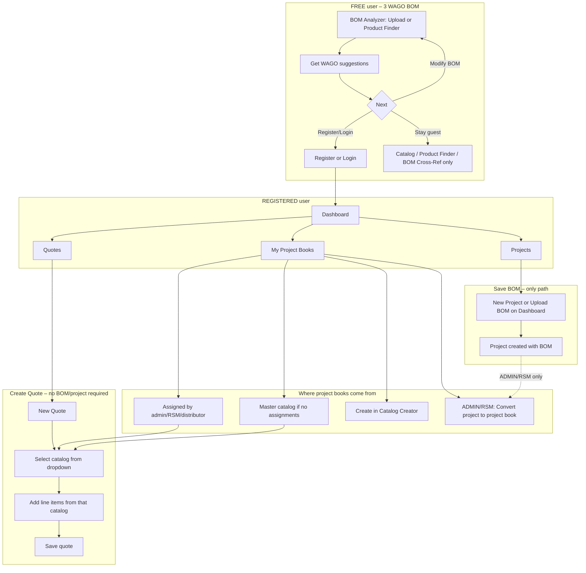
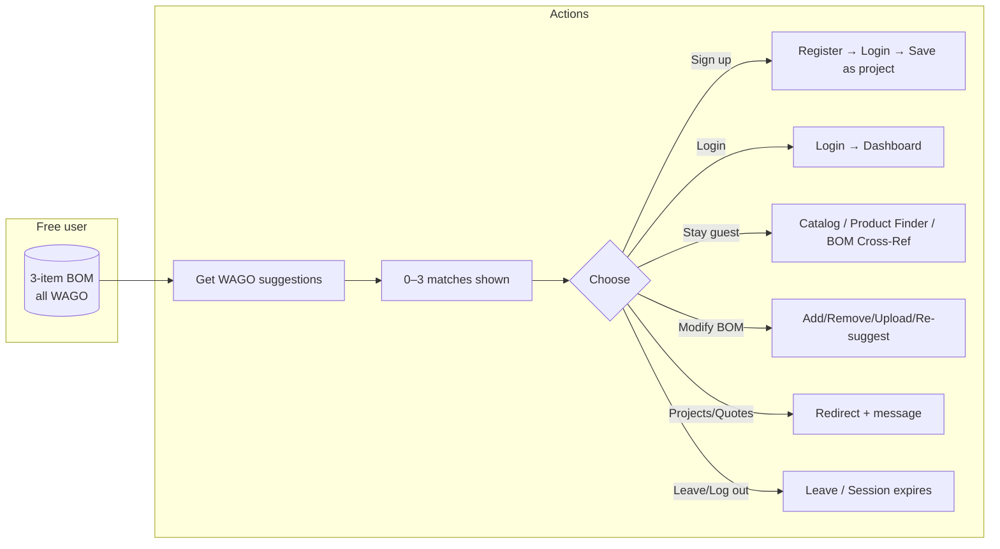
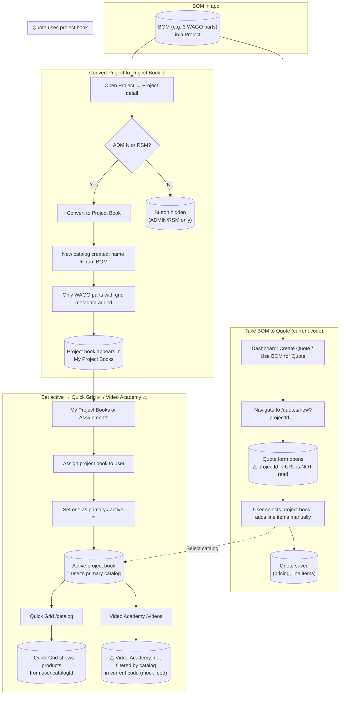
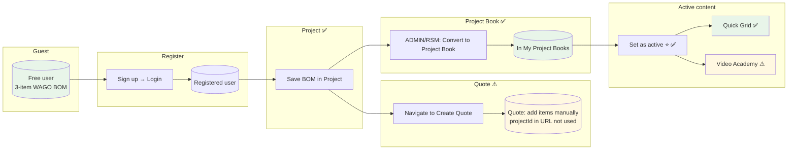

# WAIGO App – Flow Chart: Free User with 3-Item All-WAGO BOM

This document describes **actual flows** in the app (verified against the code) and flowcharts for a **free user with a 3-item all-WAGO BOM**. It answers: *Does the app require BOM → Project → Project Book to get a quote?* and *How can a user with a 3-part WAGO BOM achieve every possible function?*

**Terminology:** There is only **one Catalog — the MASTER Catalog**. All other product sources are **Project Books**. See [MASTER-CATALOG-VS-PROJECT-BOOKS.md](./MASTER-CATALOG-VS-PROJECT-BOOKS.md) for the canonical rule and how the codebase uses these terms.

---

## Direct answers (code-verified)

### Do you have to go BOM → Project → Project Book to get a quote?

**No.** In the current code:

- **Creating a quote** only requires:
  1. Being logged in.
  2. Having at least one **product source** in the quote form dropdown: that is either the **Master Catalog** or one or more **project books** assigned to you.
- That dropdown is filled by **GET /api/assignments/me**:
  - If you have **project book assignments** → you see those project books (and the Master may be in the list or used as default).
  - If you have **no assignments** → you see the **Master Catalog** only.
- You do **not** need a project. You do **not** need a BOM. You do **not** need to convert a project to a project book. So: **Quote is independent of BOM and Project.**

Flow to get a quote: **Quotes → New Quote** (or Dashboard “Create Quote”) → choose **Master Catalog or a project book** from the dropdown → add line items (search or bulk) → set customer/pricing → save.

### Can you go BOM → Project then Quote?

**Yes, but the BOM does not auto-fill the quote.**

- **BOM → Project:** Dashboard “Upload BOM” creates a project and uploads the CSV into it (`bomApi.upload` → POST /projects, then POST /projects/:id/upload-bom). So the BOM is stored in a project.
- **Project → Quote:** Dashboard “Create Quote” (or “Use BOM for Quote”) with a BOM in context navigates to **/quotes/new?projectId=...**.
- **QuoteForm** does **not** read `projectId` from the URL and does **not** load project items. So the quote form opens with no lines; the user still selects a catalog and adds line items manually. So: BOM → Project is real; Project → Quote is only a navigation shortcut, not data flow.

### When is BOM → Project → Project Book required?

**Only if you want a *project book that was generated from your BOM*.**

- **Project → Project Book** exists only as **“Convert to Project Book”** on the project detail page, and only for **ADMIN** and **RSM**. It creates a new catalog from the project’s BOM (WAGO parts with grid metadata).
- So: **BOM → Project → Project Book** is the only way to get a project book *from* that BOM, and it is restricted to ADMIN/RSM. A BASIC user cannot convert their own project to a project book; they can only create a custom project book in **Catalog Creator** (My Project Books → New Project Book) by picking products from the Master catalog.

---

## True flow: user with 3 WAGO-item BOM – every possible function

Below is the **actual** flow from the code: how a user with a 3-part (all WAGO) BOM can use the site and how they achieve each function.

### 1. As a FREE user (no login)

| Function | How it works in code |
|----------|----------------------|
| **Have a 3-item BOM** | BOM Analyzer: **Upload** tab (CSV with partNumber, etc.) Replace/Append, or **Product Finder** tab: search, “Add to BOM” × 3. |
| **Get WAGO suggestions** | BOM Table tab → “Get WAGO suggestions” → POST /api/public/cross-reference/bulk. For all-WAGO parts, usually 0 matches (cross-ref table is competitor→WAGO). |
| **Browse products** | **Quick Grid** (Catalog): public Master catalog. **Product Finder**: search. **BOM Cross-Reference**: single competitor part → WAGO. |
| **Save BOM / Create project / Create quote** | Not possible. Projects, Quotes, My Project Books require login; guest is redirected to /catalog with message. |
| **Persist anything** | No. Session ~24h; BOM is in-memory only. |

So: **Free user** = BOM Analyzer (build BOM, get suggestions) + browse-only Catalog/Product Finder/BOM Cross-Reference. To do anything with “project” or “quote” they must register (or log in).

### 2. After register / login (e.g. BASIC user)

| Function | Actual path in code |
|----------|----------------------|
| **Save the BOM** | **Only** by putting it in a **project**. Paths: (A) **Dashboard** → Upload BOM (file) → creates project + uploads CSV → redirect to project. (B) **Projects → New Project** → name + optional project book for part search → Create → on **Project detail** upload BOM CSV or add parts manually. So: **BOM → Project** is the only way to persist the BOM. |
| **Create a quote** | **Quotes → New Quote** (or Dashboard “Create Quote”). Select a **catalog** from dropdown (from GET /assignments/me: assigned catalogs or Master). Add line items via search or bulk (parts come from selected catalog). Set customer, pricing, save. **No project or BOM required.** |
| **Create a quote “from” a BOM** | Dashboard shows “Create Quote” when there’s a BOM in workflow; it goes to /quotes/new?projectId=... . QuoteForm does **not** use projectId; user still picks catalog and adds items manually. So same outcome as “Create a quote” above. |
| **Turn BOM into a project book** | **Only ADMIN/RSM:** Project detail → “Convert to Project Book” → new catalog from project BOM. **BASIC user:** cannot convert; can only create a **custom** project book in **My Project Books → New Project Book** (Catalog Creator), selecting products from Master. That new catalog is **not** auto-assigned, so it does **not** appear in the Quote form dropdown until an admin assigns it. |
| **Use a project book for quoting** | Quote form catalog dropdown = **assignments/me** only (assigned catalogs + Master if none). So you can quote from: (1) Master (if no assignments), (2) any catalog an admin/RSM/distributor assigned to you, (3) a project book created from a project by ADMIN/RSM (they get an assignment). User-created catalogs from Catalog Creator are not in that dropdown unless assigned. |
| **Quick Grid content** | **Catalog** page uses `user.catalogId` (primary) when no ?catalogId= in URL; primary comes from assignments (admin sets which catalog is primary). So “active” project book = primary catalog from assignments. |
| **Video Academy** | In code, Video Academy feed is **not** filtered by catalog; it uses mock data. So “active project book drives Video Academy” is **not** implemented. |

### 3. Order of operations (no fake dependencies)

- **Quote:** Does **not** require BOM or Project. Requires: login + at least one catalog in dropdown (assigned or Master).
- **Project (with BOM):** Requires: login. Create project (Dashboard upload BOM, or New Project then upload/add parts). No project book required to create a project; project can optionally have a “project book” for part search when adding parts.
- **Project book from BOM:** Requires: login + **ADMIN or RSM** + a project that has the BOM. Then Convert to Project Book. So **BOM → Project → Project Book** is only for that one feature and only for those roles.
- **Quick Grid “active” content:** Determined by user’s **primary catalog** from assignments (set by admin/RSM/distributor), not by creating a project or converting to project book.

So: **BOM then project then project book is *not* required to get a quote.** It is only required if you want a project book that was *generated from* that BOM, and then only for ADMIN/RSM.

---

So: **BOM then project then project book is *not* required to get a quote.** It is only required if you want a project book that was *generated from* that BOM, and then only for ADMIN/RSM.

### Actual flow diagram (no fake dependencies)



---

## Mermaid flowchart (free user – all options)

```mermaid
flowchart TB
    subgraph start["START"]
        A[("Free user (guest)<br/>3-item BOM, all WAGO parts")]
    end

    subgraph how_bom["How the BOM was built"]
        B[Upload CSV tab]
        C[Product Finder tab]
        B --> B1[Replace mode: clear & load 3 rows]
        B --> B2[Append mode: add to existing]
        C --> C1[Search → Add to BOM × 3]
    end

    subgraph bom_table["BOM Table tab"]
        T[("BOM Table<br/>(3 items)")]
        T --> G[Get WAGO suggestions]
    end

    subgraph outcomes["Get WAGO suggestions – outcomes"]
        G --> O0["0 of 3 found<br/>(typical: cross-ref has competitor→WAGO only)"]
        G --> O1["1 of 3 found"]
        G --> O2["2 of 3 found"]
        G --> O3["3 of 3 found<br/>(if WAGO→WAGO rows exist in DB)"]
        O0 --> COL0[Table shows — in WAGO suggestion column]
        O1 --> COL1[One row has suggestion; others —]
        O2 --> COL2[Two rows have suggestions; one —]
        O3 --> COL3[All three show WAGO part # + description]
    end

    subgraph from_bom["From BOM Analyzer – every option"]
        COL0 --> OPT
        COL1 --> OPT
        COL2 --> OPT
        COL3 --> OPT
        OPT{User choice}
    end

    subgraph opt_register["Option: Sign up to save"]
        OPT --> R[Click Sign up to save]
        R --> REG[/register]
        REG --> REG_FORM[Register form: email, password]
        REG_FORM --> REG_OK[Account created]
        REG_OK --> LOGIN1[Redirect to Login]
        LOGIN1 --> LOGIN_FORM[Login form]
        LOGIN_FORM --> BASIC[("BASIC user")]
        BASIC --> DASH[Dashboard]
        DASH --> NEW_PROJ[Create new project]
        NEW_PROJ --> SAVE_BOM[Upload / paste BOM → save]
        SAVE_BOM --> PERSIST[("BOM saved in project<br/>→ see BOM→Quote→Project Book flow below")]
    end

    subgraph opt_login["Option: Already have account"]
        OPT --> L[Go to Login]
        L --> LOG[/login]
        LOG --> LOG_FORM2[Login form]
        LOG_FORM2 --> ROLE{Role}
        ROLE --> BASIC2[("BASIC user → Dashboard")]
        ROLE --> OTHER[("TURNKEY / DIST / RSM / ADMIN<br/>→ Dashboard + role-specific nav")]
    end

    subgraph opt_nav["Option: Stay guest – navigate"]
        OPT --> NAV[Navigate via sidebar]
        NAV --> CAT[/catalog – Quick Grid]
        NAV --> PF[/product-finder]
        NAV --> BCR[/bom-cross-reference]
        CAT --> BROWSE[Browse master catalog]
        PF --> SEARCH[Search parts, add to BOM]
        BCR --> SINGLE[Single part cross-ref: competitor → WAGO]
    end

    subgraph opt_modify["Option: Modify BOM (stay on BOM Analyzer)"]
        OPT --> MOD[Add / remove / re-run]
        MOD --> ADD_UPLOAD[Upload tab: new CSV Replace/Append]
        MOD --> ADD_FINDER[Product Finder: search & Add to BOM]
        MOD --> REMOVE[Remove item in table]
        MOD --> SUGGEST[Get WAGO suggestions again]
        ADD_UPLOAD --> T
        ADD_FINDER --> T
        REMOVE --> T
        SUGGEST --> G
    end

    subgraph opt_restricted["Option: Try restricted route (guest)"]
        OPT --> TRY[Click Projects / Quotes / My Project Books]
        TRY --> REDIR[Redirect to /catalog]
        REDIR --> MSG["Message: Sign in to access this feature"]
    end

    subgraph opt_leave["Option: Leave or sign out"]
        OPT --> OUT[Leave tab / close browser]
        OPT --> SIGNOUT[Sign Out]
        SIGNOUT --> LOGOUT[Session cleared]
        LOGOUT --> LOGPAGE[/login]
        OUT --> EXIT[("Session expires ~24h<br/>BOM lost (not saved)")]
    end

    A --> B
    A --> C
    B1 --> T
    B2 --> T
    C1 --> T
```

---

## Simplified linear path (same scenario)



---

## Outcome summary (free user, 3-item all-WAGO BOM)

| Step | Option | Outcome |
|------|--------|--------|
| **Get WAGO suggestions** | API: `POST /api/public/cross-reference/bulk` | **0 of 3** (usual): CrossReference table maps competitor → WAGO; WAGO parts have no row. **1–3 of 3** only if admin added WAGO→WAGO cross-refs. |
| **Sign up to save** | Click “Sign up to save” → `/register` | Register → Login → BASIC user → Dashboard → can create project and **save BOM**. |
| **Login** | Go to Login → `/login` | If account exists → Dashboard (role = BASIC / TURNKEY / etc.). No guest BOM transfer; would need to re-add BOM in a new project. |
| **Quick Grid** | Sidebar → Catalog | View public (master) catalog only. |
| **Product Finder** | Sidebar → Product Finder | Search WAGO parts; no “Add to BOM” that affects BOM Analyzer (different page). |
| **BOM Cross-Reference** | Sidebar → BOM Cross-Reference | Single-part lookup: competitor P/N → WAGO equivalent. |
| **Modify BOM** | On BOM Analyzer | Upload (Replace/Append), Product Finder add, Remove item, “Get WAGO suggestions” again. |
| **Projects / Quotes / My Project Books** | Click in sidebar | **Redirect to `/catalog`** with “Sign in to access this feature”. |
| **Leave / Sign out** | Close browser or Sign Out | BOM is **not saved**; session expires ~24h. |

---

## BOM → Quote → Project → Project Book → Active content

Once a BOM is saved in a **project** (registered user), the app supports taking that BOM to a **quote**, turning the project into a **project book**, and using an **active project book** to drive what appears in **Quick Grid** and (intended) **Video Academy**. The diagram below reflects what the **code actually does**; gaps are called out in **Code verification** below.



### Flow summary (verified against code)

| Step | What the code does |
|------|--------------------|
| **BOM → Quote** | **Dashboard** (`DashboardWorkflow.tsx`) navigates to `/quotes/new?projectId=${projectId}` when user clicks "Create Quote" with a BOM/project. **QuoteForm** does **not** read `projectId` from the URL (it only uses `useParams()` for `quoteId`). So the quote form opens with no project items preloaded; the user must select a project book (catalog) and add line items manually. There is no backend endpoint that loads project items into a new quote. |
| **BOM → Project** | ✅ BOM is stored in a **project** via upload to new project or empty project + add parts. Confirmed in `DashboardWorkflow`, `projectApi`, `ProjectDetail`. |
| **Project → Project Book** | ✅ **ADMIN** or **RSM** can run **Convert to Project Book** on a project (`project.controller.ts` `convertToProjectBook`, `ProjectDetail.tsx` button). Creates a new catalog from project BOM (WAGO parts with grid metadata). New project book appears in My Project Books. |
| **Set active project book** | ✅ In **Accounts** / **Assignments**, assign project books and set one as primary (`assignments.controller.ts`, `primaryCatalogId`). User’s primary catalog is stored and used. |
| **Quick Grid** | ✅ **Quick Grid** (`Catalog.tsx`) uses `user?.catalogId` when no `catalogId` in URL; guests use public catalogs. So the active (primary) project book **does** define what the user sees. |
| **Video Academy** | ⚠ **Not implemented as “driven by active project book”.** `VideoFeed.tsx` uses **mock data** (hardcoded list) and has `// TODO: Load videos from API`. No catalog filtering in the video feed or video API for the logged-in user’s catalog. So the *intended* behavior (Video Academy scoped to project book) is **not** in the current code. |

### Code verification (what was checked)

| Flow | Source / check | Result |
|------|----------------|--------|
| Dashboard → Quote with projectId | `DashboardWorkflow.tsx` `handleUseBomForQuote` → `navigate(\`/quotes/new?projectId=${projectId}\`)` | ✅ Navigation happens. |
| QuoteForm reads projectId | `QuoteForm.tsx`: only `useParams()` for `quoteId`; no `useSearchParams` or `projectId` | ❌ projectId in URL is **not** used; no preload of project items. |
| Project → Project Book | `project.controller.ts` `convertToProjectBook`, `ProjectDetail.tsx` `canConvertToProjectBook`, `handleConvertToProjectBook` | ✅ Implemented (ADMIN/RSM only). |
| Quick Grid uses primary catalog | `Catalog.tsx`: `user?.catalogId`, `catalogIdFromUrl` in `resolveCatalog` | ✅ Implemented. |
| Video Academy uses catalog | `VideoFeed.tsx`: mock data; `videoLibraryService` / routes: no catalog filter for feed | ❌ Not implemented. |

### Full flow overview (from free user to active content)

Legend: ✅ implemented in code; ⚠ intended but not fully implemented.



---

## Notes

- **All-WAGO BOM**: “Get WAGO suggestions” uses the **CrossReference** table (competitor manufacturer + part number → WAGO part). For parts already marked as WAGO there are usually **no** rows, so the result is often **0 of 3** and the table shows “—” in the WAGO suggestion column.
- **Guest allowed paths**: `/catalog`, `/product-finder`, `/bom-cross-reference`, `/bom-analyzer`. All other app routes require sign-in; guest is redirected to `/catalog` with a message if they try restricted routes.
- **After register**: User becomes BASIC; can create projects and save BOMs. The in-memory guest BOM is **not** auto-imported; they must create a project and upload or re-enter the BOM.
